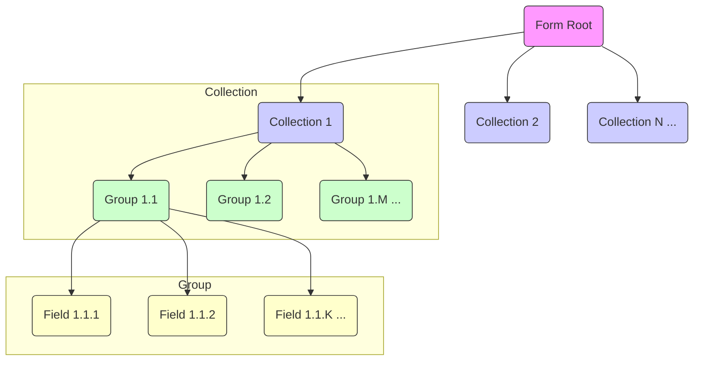
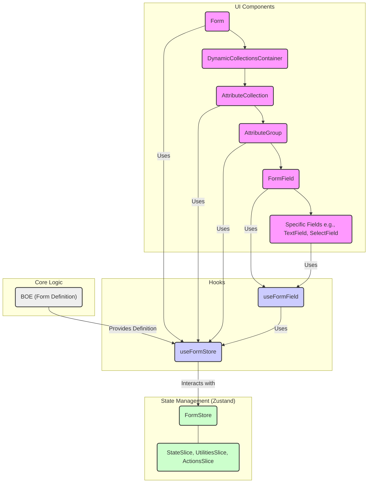
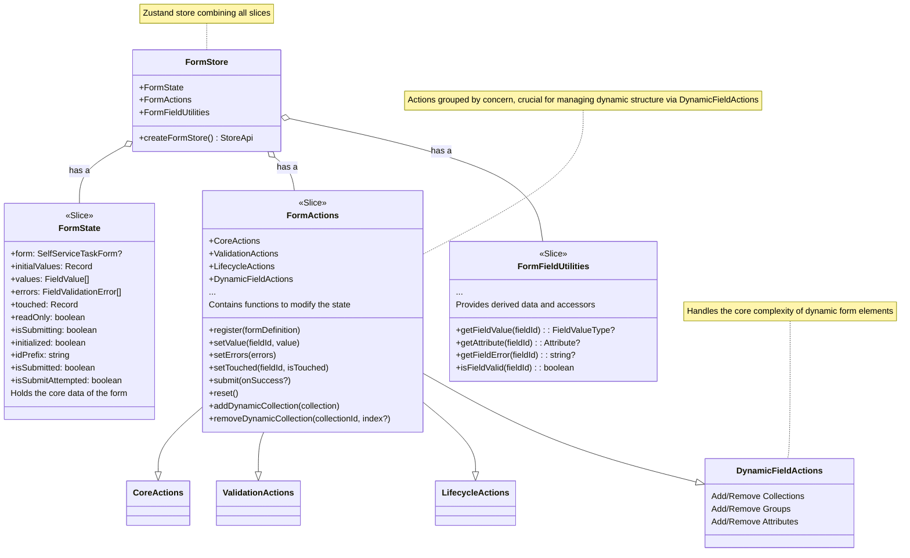

## はじめに

前回のテックブログ記事『[【React】memo, useMemo, useCallback を使いこなす](https://zenn.dev/dress_code/articles/bd577b38e1c700)』ではメモ化 API について解説しました。その中で触れた、「企業活動における「手続き」や「申請」に利用する汎用的なフォーム生成モジュール」の設計に焦点を当てます。

DRESS CODEで扱うフォームは、「入社手続き」や「アカウント利用申請」などの実業務で使用されるため以下の特徴があります。

- **動的な構造**: フォームの項目は固定ではなく、目的ごとに規定される定義によって動的に決定されます。
- **階層構造**: フォームは複数の「コレクション (`AttributeCollection`)」で構成され、各コレクションは複数の「グループ (`AttributeGroup`)」を持ち、各グループが個別の「フィールド (`Attribute`)」を含むという、ネストした階層構造を持ちます。
- **動的な増減**: ユーザー操作や他のフィールドの値に応じて、コレクション、グループ、フィールド自体が動的に追加されたり削除されたりする場合があります（例：家族情報）。




これらの複雑な要件に対応し、パフォーマンスの良い状態管理を実現するために、[Zustand](https://github.com/pmndrs/zustand) を採用しました。

https://zustand.docs.pmnd.rs/getting-started/introduction

## なぜ Zustand か？ - 複雑なフォーム要件への適合性

前述のような複雑なフォーム要件（動的な構造、階層構造、動的な増減）を踏まえ、DRESS CODE では Zustand を選択しました。他の有力な状態管理ライブラリ（Jotai, Valtio など）と比較検討した結果、以下の理由で Zustand が最適だと判断しました。

- **パフォーマンス**: Zustand は React の Context API に直接依存せず、ストアの更新が必要なコンポーネントのみを選択的に再レンダリングします（サブスクリプションベース）。これは、多数のフィールドが頻繁に、かつ動的に変化するフォームにおいて、不要な再レンダリングを抑制し、アプリケーション全体のパフォーマンスを維持するために不可欠です。[`subscribeWithSelector`](https://zustand.docs.pmnd.rs/middlewares/subscribe-with-selector) ミドルウェアを使えば、細やかな最適化も可能です。
- **柔軟性とスケーラビリティ (Slice パターン)**: 状態やロジックが多岐にわたる場合、関心事を分離してコードの見通しを良く保つことが重要です。Zustand はストアが単一のオブジェクトであり、`set` 関数で部分的に更新できるため、機能をスライス（分割）して管理する「Slice パターン」との相性が抜群です。階層構造や動的な増減といった複雑なロジックも、関連するスライス内でカプセル化しやすくなります。これは、Atom ベースの Jotai では、複雑な依存関係を持つフォーム全体の状態としては管理が煩雑になる可能性があると考えた点との比較になります。
- **ミドルウェアとエコシステム**: Immer や Redux DevTools といったデファクトスタンダードなミドルウェアが利用可能です。特に **Immer** は、深いネスト構造を持つ状態オブジェクトをイミュータブルに更新する際の記述を簡略化し、開発体験にも寄与します。

## 全体アーキテクチャ

主にUI コンポーネント、状態管理 (Zustand ストア)、カスタムフックで構成します。
- **UI Components**: 階層構造（Collection > Group > Field）に対応したコンポーネントが動的にレンダリングされます。
- **Hooks**: UI コンポーネントと状態管理層を繋ぐ役割を果たします。`useForm` はフォーム全体、`useFormField` は個々のフィールドの操作と状態アクセスを抽象化します。`useFormStore` はストアへのアクセスを提供します。
- **State Management**: Zustand ストア (`FormStore`) がアプリケーションの状態を一元管理します。後述する Slice パターンで構成されています。





## 設計戦略: Slice パターンによる関心の分離

前述の複雑な要件に対応するため、**Slice パターン** を採用し、関心を明確に分離しています。ストアは主に以下の 3 つのスライスから構成されます。



1.  **State Slice (`createStateSlice`)** (`state.slice.ts`):

    - **責務**: フォームのコアとなる状態（`values`, `errors`, `touched`, `isSubmitting` など）と、フォーム定義 (`form`) 自体を保持します。階層構造を持つフィールドの値やエラー情報も、フラットな配列やオブジェクトで管理されます。
    - **役割**: アプリケーションの状態のスナップショットを提供します。純粋なデータコンテナとしての役割に徹します。

2.  **Actions Slice (`createActionsSlice`)** (`actions.slice.ts`):

    - **責務**: 状態を変更するためのアクション（`setValue`, `setErrors`, `submit`, `reset` など）を定義します。状態変更ロジックを集約し、副作用（例: バリデーションの実行）を管理します。
    - **役割**: フォームの動的な性質に対応する上で中心的な役割を担います。特に `DynamicFieldActions` グループ（`addDynamicCollection`, `removeDynamicCollection`, `addDynamicGroup` など）は、**コアな複雑性** であるフォームの階層構造（Collection, Group, Field）を動的に変更するロジックをカプセル化します。これにより、UI コンポーネントや Hook は、状態の内部構造や整合性維持の詳細を意識することなく、「コレクションを追加する」「フィールドを削除する」といった **宣言的な指示** を出すだけで済みます。Immer ミドルウェアと組み合わせることで、これらの複雑な状態更新も比較的シンプルに記述できます。このカプセル化こそが、Slice パターンと Actions Slice の大きなメリットです。

3.  **Utilities Slice (`createUtilitiesSlice`)** (`utilities.slice.ts`):
    - **責務**: 状態から派生する値や、状態へのアクセスを容易にするためのユーティリティ関数（`getFieldValue`, `getAttribute`, `getFieldError`, `isFieldValid` など）を提供します。これらは Store 内部で完結するセレクターのようなものです。
    - **役割**: コンポーネントが必要とする形式に状態を加工したり、特定のフィールドの状態（値、エラー、定義）を容易に取得するインターフェースを提供します。これにより、コンポーネントはストアの内部構造の詳細を知らなくても、必要な情報に簡単にアクセスでき、状態の詳細な構造への依存を減らします。

これらのスライスは `createFormStore` 関数を通じて `FormStore` が生成されます。

```typescript
import { type StoreApi, create } from "zustand";
import { devtools, subscribeWithSelector } from "zustand/middleware";
import { immer } from "zustand/middleware/immer";
import {
  createActionsSlice,
  type FormActions,
} from "./slices/actions.slice"; 
import {
  createStateSlice,
  type FormState, 
} from "./slices/state.slice";
import {
  createUtilitiesSlice,
  type FormFieldUtilities,
} from "./slices/utilities.slice"; 
import type { ImmerSetFunction, SetAdapter } from "./types"; 

// --- Adapter Pattern ---
const createSetAdapter = (rawSet: ImmerSetFunction): SetAdapter => ({
  // スライス向けのセット関数: 部分的な状態更新を受け付け、型安全にマージする
  sliceSet: (fn) => {
    rawSet((state) => {
      const partial = fn(state);
      Object.assign(state, partial);
    });
  },
  rawSet: (fn) => {
    rawSet(fn);
  },
});
// --- End Adapter Pattern ---

// FormStore 型の定義 (全スライスの結合)
export type FormStore = FormState & FormActions & FormFieldUtilities;

export const createFormStore = (): StoreApi<FormStore> => {
  return create<FormStore>()(
    subscribeWithSelector(
      devtools(
        immer((set, get, api) => {
          // Immer によるイミュータブル更新
          // State Slice: 初期状態を定義
          const stateSlice = createStateSlice({
            /* ...initial state... */
            form: undefined,
            initialValues: {},
            values: [],
            errors: [],
            touched: {},
            isSubmitting: false,
            isSubmitted: false,
            isSubmitAttempted: false,
          });

          // Adapter パターンで set 関数をラップ
          const adapter = createSetAdapter(set as ImmerSetFunction);

          // Actions Slice: 状態変更ロジック
          const actionsSlice = createActionsSlice(adapter.sliceSet, get, api);
          // Utilities Slice: 派生データとアクセサ
          const utilitiesSlice = createUtilitiesSlice(get, api); 

          // すべてのスライスを結合してストアの状態とする
          return {
            ...stateSlice,
            ...actionsSlice,
            ...utilitiesSlice,
          };
        }),
        { name: "FormStore" } 
      )
    )
  );
};
```

## 動的フォームへの対応: Actions Slice の核心

中核的な要件である「動的なフォーム構造への対応」は、主に **Actions Slice** (`actions.slice.ts`)、特にその中の `DynamicFieldActions`によって実現されています。

- **`addDynamicCollection`, `removeDynamicCollection`**: フォームにコレクション（フォームの大きなセクション）を追加・削除します。
- **`addDynamicGroup`, `removeDynamicGroup`**: コレクション内にグループ（関連する項目のまとまり）を追加・削除します。
- **`addDynamicAttribute`, `removeDynamicAttribute`**: グループ内にフィールド（個々の項目）を追加・削除します。

これらのアクションは単なる状態変更ではなく、フォーム全体の整合性を維持する複雑なロジックをカプセル化しています。

例えば、特定のコレクションを削除する場合

```typescript
removeDynamicCollection: (
  collectionId: AttributeCollectionId,
  collectionIndex?: number,
) => {
  set((state) => {
    if (!state.form?.form?.attributeCollections) {
      return state;
    }

    // 特定のインデックスが指定されている場合、そのインデックスのコレクションのみを削除
    if (collectionIndex !== undefined) {
      // 削除するコレクションの特定
      const collectionsWithId = state.form.form.attributeCollections.filter(
        (c) => c.id === collectionId,
      );

      // コレクションが存在しない場合は処理中止
      if (collectionsWithId.length === 0) {
        return state;
      }

      // 同じIDを持つコレクションのインデックスを取得
      const targetIndices = updatedCollections
        .map((c, i) => (c.id === collectionId ? i : -1))
        .filter((i) => i !== -1);

      // 実際のコレクション配列内のインデックス
      const actualIndex = targetIndices[collectionIndex];

      // コレクションを削除
      updatedCollections = updatedCollections.filter(
        (_, i) => i !== actualIndex,
      );

      // フォーム定義の更新だけでなく、関連する値も削除
      const newValues = state.values.filter((value) => {
        const parsedFieldId = parseFieldId(value.fieldId);
        return !(
          parsedFieldId?.collectionId === collectionId &&
          parsedFieldId?.collectionIndex === collectionIndex
        );
      });

      // 削除したインデックス以降のフィールドIDを調整（インデックスの再割り当て）
      const adjustedValues = newValues.map((value) => {
        const parsedFieldId = parseFieldId(value.fieldId);
        if (
          parsedFieldId &&
          parsedFieldId.collectionId === collectionId &&
          parsedFieldId.collectionIndex > collectionIndex
        ) {
          // インデックスを1つ減らした新しいフィールドIDを生成
          return {
            ...value,
            fieldId: createFieldId({
              collectionId: parsedFieldId.collectionId,
              collectionIndex: parsedFieldId.collectionIndex - 1,
              groupId: parsedFieldId.groupId,
              groupIndex: parsedFieldId.groupIndex,
              attributeId: parsedFieldId.attributeId,
            }),
          };
        }
        return value;
      });

      return {
        form: {
          ...state.form,
          form: {
            ...state.form.form,
            attributeCollections: updatedCollections,
          },
        },
        values: adjustedValues,
      };
    }
    
    return state;
  });
}
```
このアクションでは以下のような処理が行われています
1. フォーム定義からコレクションを削除
2. 削除されたコレクションに関連する値を状態から削除
3. 削除後のインデックス構造を調整（インデックスの再割り当て）
これらの複雑な処理がActions Sliceによってカプセル化されることで、UIコンポーネントは内部実装を知る必要なく、removeDynamicCollection(collectionId, index)のような単純なAPIで動的なフォーム操作を実現できます。

## 動的フォーム生成モジュールの利用例

動的フォーム生成モジュールの内部的なストア設計に焦点を当てましたが、モジュール内部の複雑さを隠蔽し、フォーム利側には簡潔で直感的なAPIを提供します。

```typescript
import {
  FormWrapper,
  Form,
  AttributeCollection,
  DynamicCollectionsContainer,
  DynamicCollectionAddButton,
  useForm,
} from "@/features/form-factory";
import { Button } from "@/components/ui/button";

function MyFormComponent({
  formDefinition,
  initialValues,
  onSubmit,
  onCancel,
}: MyFormComponentProps) {
  // フォームラッパーが内部でストアを作成・管理
  return (
    <FormWrapper 
      formDefinition={formDefinition} 
      initialValues={initialValues}
    >
      <FormContent onSubmit={onSubmit} onCancel={onCancel} />
    </FormWrapper>
  );
}

function FormContent({
  onSubmit,
  onCancel,
}: {
  onSubmit: (values: FieldValue[]) => Promise<void>;
  onCancel: () => void;
}) {
  // useFormフックで必要な状態とアクションにアクセス
  const {
    initialized,
    submit,
    hasErrors,
    isSubmitting,
    errors,
  } = useForm({
    onSubmit: onSubmit,
  });

  if (!initialized) {
    return <div>Loading...</div>;
  }

  return (
    <Form
      className="space-y-6"
      onSubmit={(e) => {
        e.preventDefault();
        submit();
      }}
    >
      {/* 動的コレクションコンテナ - コレクションを自動レンダリング */}
      <DynamicCollectionsContainer />
      
      {/* 動的コレクション追加ボタン */}
      <DynamicCollectionAddButton />
      
      {/* エラー表示 */}
      {hasErrors && (
        <div className="text-red-500">
          {errors.map(err => (
            <div key={err.fieldId}>{err.message}</div>
          ))}
        </div>
      )}
      
      {/* フォームボタン */}
      <div className="flex justify-end gap-2">
        <Button
          type="button"
          variant="outline"
          onClick={onCancel}
          disabled={isSubmitting}
        >
          キャンセル
        </Button>
        <Button 
          type="submit" 
          disabled={isSubmitting || hasErrors}
        >
          {isSubmitting ? "送信中..." : "送信"}
        </Button>
      </div>
    </Form>
  );
}
```
このようにモジュールを利用する側は、以下の点だけに集中できます。
1. フォーム定義の提供: APIから取得したフォーム構造定義
2. 初期値の設定: 必要に応じて初期値を提供
3. イベントハンドラの定義: 送信・キャンセル等の処理
4. レイアウトの調整: コンポーネントの配置やスタイル

## Zustand を採用したメリットと考察

Zustand と Slice パターンを導入したことで、複雑な要件に対して以下の具体的なメリットが得られました。

- **関心の分離による保守性の向上**: 状態、状態変更ロジック、派生データの取得ロジックが明確に分離（State, Actions, Utilities スライス）されたことで、コードの見通しが格段に向上し、機能追加や修正が容易になりました。特に、動的なフォーム構造の変更という最も複雑なロジックが Actions Slice (`DynamicFieldActions`) に集約されたことで、影響範囲の特定とテストが容易になりました。
- **宣言的な状態更新と UI の分離**: UI コンポーネントや Hook は、状態の内部構造や複雑な更新手順（例: 動的要素削除時の整合性維持）を意識することなく、「フィールドの値セット」「コレクションの削除」といった宣言的なアクションを呼び出すだけで良くなりました。これにより、UI と状態管理ロジックの結合度が低下しました。
- **パフォーマンスの最適化**: Zustand のサブスクリプションモデルと `subscribeWithSelector` により、不要な再レンダリングが効果的に抑制され、多数のフィールドを持つ大規模で動的なフォームでも軽快な動作を実現できています。
- **高い型安全性**: TypeScript の厳格な型定義と、スライス間の安全な状態更新を保証する Adapter パターンの導入により、複雑な状態構造と動的な変更にもかかわらず、型エラーによるランタイムバグを大幅に削減できました。
- **デバッグ体験**: Redux DevTools との連携により、状態遷移の追跡や問題発生時の原因特定が容易になり、開発効率が向上しました。

## まとめ

本記事では、動的な階層構造を持つ複雑なフォームの実装課題とその解決策について解説しました。Zustand と Slice パターンを組み合わせることで、複雑な要件に対応しながらも保守性と拡張性の高いコード設計を実現できました。

今後の発展としては、さらなるパフォーマンス最適化やアクセシビリティの強化、フォーム定義のスキーマ拡張などが考えられますが、Slice パターンによる関心の分離という設計思想を維持することで、拡張性と保守性の高いモジュールとして継続的に進化させていきたいです。

Zustandは比較的シンプルなAPIながらも高い柔軟性を持ち、このような複雑なユースケースにも対応できることを実証できました。適切な設計パターンと組み合わせることで、大規模なアプリケーション開発においても有力な状態管理ライブラリの選択肢となり得ると考えています。