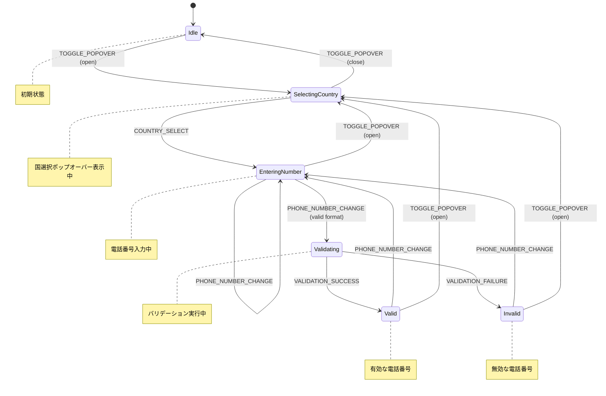
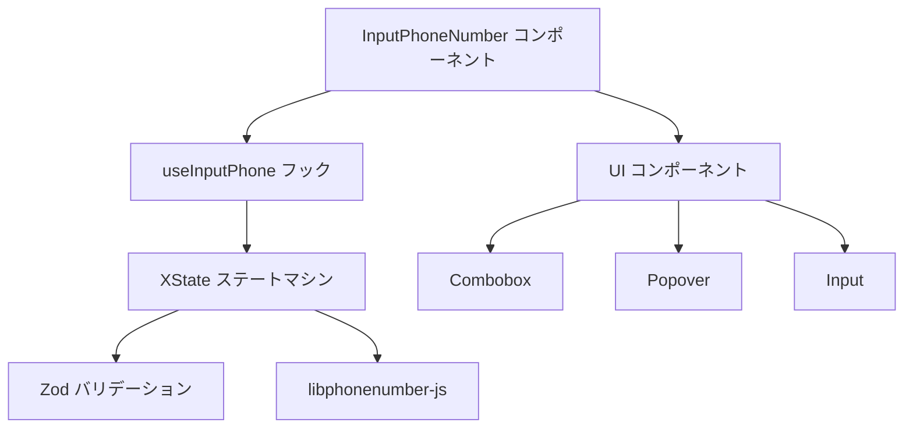

## はじめに


前回書いた[「複雑な動的フォームを制覇する: Zustand Slice パターンによる状態管理戦略」](https://zenn.dev/dress_code/articles/182c18acfa58b3)では、複雑な動的フォーム生成に関するDRESS CODEの現在の設計の一部を紹介しました。

今回は、**グローバル × BtoB SaaS** ならではのフロントエンド開発の面白みや工夫の一例として、
**国際電話番号入力コンポーネント**の実装について、その設計思想や技術的な挑戦、得られた学びを共有したいと思います。


## なぜ国際電話番号入力が難しいのか？ 🤔

一見すると単純な入力フォームに見える電話番号ですが、「国際対応」となると、その複雑さは格段に増します。

- **多様な国コード:** 世界には 200 以上の国と地域があり、それぞれに固有の国コード（例: 日本 +81, アメリカ +1）が存在します。
- **フォーマットの差異:** 国によって電話番号の桁数やハイフンの有無、市外局番の扱いなどが異なります。
- **リアルタイムなバリデーション:** ユーザーが入力するたびに、選択された国コードに基づいて番号の有効性を検証する必要があります。
- **UX の考慮:** ユーザーが自国の国コードを簡単に見つけ、スムーズに入力できるようなインターフェースが求められます。

これらの要素が絡み合い、国際電話番号入力コンポーネントの開発は、思った以上に奥深い課題となります。

## 私たちが直面した課題 📝

DRESS CODEは創業初期からグローバル展開を前提としており、既に様々な地域のユーザーにご利用いただいています。
そのため、国際電話番号入力機能は、従業員登録や連絡先設定など、多くのユースケースで必要不可欠な要素です。

設計に着手するにあたって具体的には以下の4点が課題と捉えました。

1.  **状態管理の複雑化:** 国コードの選択状態、入力中の電話番号、フォーマットされた番号、バリデーション結果（有効/無効）、エラーメッセージ、国選択ポップオーバーの開閉状態など、管理すべき状態が多岐にわたり、`useState` だけでは管理が煩雑になりがち。
2.  **リアルタイム性とパフォーマンス:** 入力や国コード変更のたびにリアルタイムでフォーマットとバリデーションを行う必要がありましたが、パフォーマンスへの影響も懸念されました。
3.  **バリデーションロジックの散在:** 各国固有のバリデーションルールをコンポーネント内に直接記述すると、コードの見通しが悪くなり、メンテナンス性も低下します。
4.  **テスト容易性:** 複雑な状態遷移とバリデーションロジックが絡み合うため、ユニットテストや結合テストの作成が難しく、品質担保に不安がありました。

これらの課題を解決し、**堅牢で保守性が高く、i18nやa11y対応を満たせる国際電話番号入力コンポーネント**を実現することが必要でした。

## 設計戦略：複雑さに立ち向かうためのアプローチ 🚀

課題解決のため、私たちはいくつかの選択肢を検討しました。例えば [`react-phone-number-input`](https://www.npmjs.com/package/react-phone-number-input) のような高機能なライブラリを利用することも考えましたが、最終的には独自のコンポーネントを実装する選択をしました。その主な理由は、**プロダクトの世界観を体現する UI を細部までコントロールしたい**という想いがあったからです。

ただし、ゼロからすべてを作るのではなく、電話番号に関する複雑なロジック（フォーマット、バリデーション、国情報の管理など）については、実績のあるライブラリの力を借りることにしました。そこで採用したのが [`libphonenumber-js`](https://github.com/catamphetamine/libphonenumber-js) です。これは `react-phone-number-input` の内部でも利用されているライブラリであり、Google の `libphonenumber` を JavaScript 向けに移植したものです。**ISO 3166-1 に準拠した国コードを網羅しており、ニッチな地域を含む国際的な電話番号を高い精度で扱える**点が、グローバル展開を目指す私たちにとって非常に魅力的でした。

https://github.com/catamphetamine/libphonenumber-js

この方針のもと、私たちは以下の具体的な設計戦略を採用しました。

### 1. 状態管理の選択：XState による宣言的な状態遷移

複雑な状態遷移を管理するために、DRESS CODEでは **[XState](https://xstate.js.org/docs/)** を採用しています。XState はステートマシンとステートチャートの概念に基づいており、UI の状態遷移を宣言的かつ視覚的に管理できます。

これにより、「どのイベントが」「どの状態遷移を引き起こし」「どのようなアクション（副作用）を実行するか」が明確になり、状態管理のロジックがコンポーネントから分離され、見通しが格段に向上しました。

https://xstate.js.org/docs/

**状態遷移図 (Mermaid):**



### 2. バリデーション：Zod による型安全な検証

私たちのアプリケーションでは、**開発当初から Zod を用いたスキーマベースのバリデーションを全面的に採用**しています。これは、TypeScript との親和性の高さや、宣言的なスキーマ定義による可読性・保守性の向上、そしてコンパイル時と実行時の両方で型安全性を確保できる点を評価したためです。

国際電話番号入力コンポーネントにおいても、この方針を踏襲しました。Zod の `superRefine` を活用することで、**アプリケーション全体のバリデーション戦略と一貫性を保ちつつ**、`libphonenumber-js` と連携した複雑なカスタムバリデーションロジックを、型安全かつ宣言的に実装することができました。

- - **型安全性:** スキーマ定義から TypeScript の型を推論できるため、コンパイル時と実行時の両方で型安全性を確保できます。
- - **宣言的なスキーマ:** バリデーションルールを簡潔かつ宣言的に記述できます。
- - **柔軟なカスタマイズ:** `superRefine` を使うことで、複雑なカスタムバリデーションロジックも実装可能です。

私たちは `libphonenumber-js` というライブラリと Zod を組み合わせ、選択された国コードに応じた電話番号の有効性チェックを行うスキーマを作成しました。

### 3. コンポーネント分割と責務

コンポーネントの責務を明確にするため、以下のようにファイルを分割しました。

- `InputPhoneNumber.tsx`: UI のレンダリングを担当するメインコンポーネント。
- `useInputPhone.ts`: 状態マシンとの連携、イベントハンドリング、副作用の管理を行うカスタムフック。
- `state-machine.ts`: XState を用いた状態マシンの定義。状態遷移ロジックを集約。
- `zod-schema.ts`: Zod スキーマによる電話番号バリデーションの定義。


これにより、各モジュールの関心事が明確になり、コードの再利用性、テスト容易性、保守性が向上しました。

**ディレクトリ構成**

```plaintext
src/apps/app/src/components/Input/Phone/
├── InputPhoneNumber.stories.tsx # Storybook 用カタログ
├── InputPhoneNumber.tsx         # React コンポーネント (UI レイヤー)
├── state-machine.test.ts      # 状態マシンのユニットテスト
├── state-machine.ts             # XState 状態マシン定義 (状態管理レイヤー)
├── useInputPhone.ts             # カスタムフック (ロジックレイヤー)
├── zod-schema.test.ts         # スキーマのユニットテスト
└── zod-schema.ts              # Zod スキーマ定義 (バリデーションスキーマレイヤー)
```

**コンポーネント関係図**




## 具体的な実装例 ⚔️

実装のキーポイントとなる部分をコード例とともに見ていきましょう。

### 1. 状態マシンの設計 (XState)

`state-machine.ts` では、`setup` 関数を使って状態マシンを定義します。`context` にはマシンの状態（入力値、選択国、エラーなど）、`events` には発生しうるイベント、`actions` には状態遷移時に実行される処理（副作用）を定義します。

```typescript
import { assign, emit, setup, fromPromise } from "xstate";
import { phoneNumberSchema } from "./zod-schema";
import {
  AsYouType,
  isValidPhoneNumber,
  type CountryCode,
} from "libphonenumber-js";
// ... 他の import

export const createPhoneInputMachine = (
  {
    /* ... */
  }
) => {
  const machine = setup({
    types: {
      context: {} as PhoneContext,
      events: {} as PhoneEvent,
      emitted: {} as ValueChangeEvent, // 親コンポーネントへの通知用
    },
    actions: {
      updatePhoneNumber: assign(({ context, event }) => {
        if (event.type !== "PHONE_NUMBER_CHANGE") return {};
        const formatter = new AsYouType(context.selectedCountry.code);
        const formattedNumber = formatter.input(event.value);
        // Zod スキーマでバリデーション実行
        const result = phoneNumberSchema(
          context.selectedCountry.code
        ).safeParse(event.value);
        return {
          phoneNumber: event.value,
          formattedNumber,
          error: result.success
            ? null
            : result.error.issues[0]?.message || "Invalid phone number",
        };
      }),
      // 親コンポーネントに変更を通知するアクション
      notifyPhoneNumberChange: emit(({ context }) => ({
        type: "valueChange" as const,
        value: {
          /* ... formatted value ... */
        },
      })),
      updateSelectedCountry: assign(({ context, event }) => {
        // ... 国コード変更時の処理 ...
        // 国が変わったら再度バリデーション
        const result = phoneNumberSchema(newCountry.code).safeParse(
          context.phoneNumber
        );
        return {
          selectedCountry: newCountry,
          // ... formattedNumber, error 更新 ...
          isOpen: false, // ポップオーバーを閉じる
        };
      }),
      // ... 他のアクション (togglePopover, updateSearchText etc.)
    },
    guards: {
      // ガード関数で遷移条件を定義
      isValidPhoneNumber: ({ context }) => {
        if (!context.phoneNumber) return true; // 空の場合はOKとするなど
        return phoneNumberSchema(context.selectedCountry.code).safeParse(
          context.phoneNumber
        ).success;
      },
    },
    // ... actors (非同期処理) ...
  }).createMachine({
    id: "phoneInput",
    initial: "idle",
    context: {
      /* ... initial context ... */
    },
    states: {
      idle: {
        on: {
          TOGGLE_POPOVER: {
            target: "selectingCountry",
            actions: "togglePopover",
          },
          PHONE_NUMBER_CHANGE: {
            target: "enteringNumber",
            actions: "updatePhoneNumber",
          },
        },
      },
      selectingCountry: {
        // ... 国選択中の状態と遷移 ...
      },
      enteringNumber: {
        on: {
          PHONE_NUMBER_CHANGE: [
            // ガードを使ってバリデーション結果で遷移先を分岐
            {
              target: "valid",
              guard: "isValidPhoneNumber",
              actions: ["updatePhoneNumber", "notifyPhoneNumberChange"],
            },
            {
              target: "invalid",
              actions: ["updatePhoneNumber", "notifyPhoneNumberChange"],
            },
          ],
          TOGGLE_POPOVER: {
            target: "selectingCountry",
            actions: "togglePopover",
          },
          // ... 他のイベント ...
        },
      },
      valid: {
        /* ... 有効な状態 ... */
      },
      invalid: {
        /* ... 無効な状態 ... */
      },
    },
  });
  return machine;
};
```

`emit` を使うことで、状態マシン内部から親コンポーネント（このマシンを使用するコンポーネント）へイベントを発行（`valueChange`）し、値の変更を通知しています。これにより、状態マシンの内部実装を隠蔽しつつ、必要な情報だけを外部に公開できます。

### 2. React コンポーネントの実装 (`InputPhoneNumber.tsx`, `useInputPhone.ts`)

コンポーネント (`InputPhoneNumber.tsx`) は主に UI の表示に責任を持ち、ロジックの大部分はカスタムフック (`useInputPhone.ts`) に委譲します。

**カスタムフック (`useInputPhone.ts`):**

```typescript
import { useActor } from "@xstate/react";
import { useCallback, useEffect, useMemo, useRef } from "react";
import { createPhoneInputMachine, type PhoneValue } from "./state-machine";
// ... 他の import

export const useInputPhone = (
  value: PhoneValue,
  onChange: (value: PhoneValue) => void,
  defaultCountry: CountryCode
) => {
  const { t } = useTranslation(defaultNS);
  const initialValueRef = useRef(value); // 初期値の参照を保持

  // マシンのインスタンス生成 (useMemoで不要な再生成を防ぐ)
  const machine = useMemo(
    () =>
      createPhoneInputMachine({
        initialValue: initialValueRef.current,
        defaultCountry,
        t, // 翻訳関数をマシンに渡す
      }),
    [defaultCountry, t]
  );

  // useActor フックでマシンを実行し、状態(state)と送信関数(send)を取得
  const [state, send, actor] = useActor(machine);

  // マシンからの 'valueChange' イベントを購読し、onChange コールバックを実行
  useEffect(() => {
    const subscription = actor.on("valueChange", (event) => {
      onChange(event.value);
    });
    return () => subscription.unsubscribe(); // クリーンアップ
  }, [actor, onChange]);

  // コンポーネントからマシンへイベントを送信するハンドラ関数
  const handlePhoneNumberChange = useCallback(
    (e: React.ChangeEvent<HTMLInputElement>) => {
      send({ type: "PHONE_NUMBER_CHANGE", value: e.target.value });
    },
    [send]
  );

  const handleCountryCodeChange = useCallback(
    (dialCode: string | null) => {
      if (dialCode) {
        send({ type: "COUNTRY_SELECT", dialCode });
      }
    },
    [send]
  );

  // ... 他のハンドラ (handleSearchChange, togglePopover)

  // コンポーネントが必要とする状態とハンドラを返す
  return {
    formattedNumber: state.context.formattedNumber,
    selectedCountry: state.context.selectedCountry,
    error: state.context.error,
    isOpen: state.context.isOpen,
    // ... 他の状態とハンドラ
    handlePhoneNumberChange,
    handleCountryCodeChange,
    // ...
  };
};
```

`useActor` フックで XState マシンと接続し、`state` (現在の状態) と `send` (イベント送信関数) を取得します。`useEffect` 内でマシンの `valueChange` イベントを購読し、親コンポーネントから渡された `onChange` コールバックを呼び出しています。UI イベント（入力変更、国選択など）が発生すると、対応するハンドラ関数が `send` を使ってマシンにイベントを送信します。

**コンポーネント (`InputPhoneNumber.tsx`):**

```tsx
// src/apps/app/src/components/Input/Phone/InputPhoneNumber.tsx
import { useInputPhone } from "./useInputPhone";
import Input from "../Input"; // 既存の Input コンポーネントを再利用
import Combobox from "@/components/Combobox"; // 国選択用コンボボックス
import {
  Popover,
  PopoverTrigger,
  PopoverContent,
} from "@/components/ui/popover";
import Icon from "@/components/Icon/Icon";
// ... 他の import

export const InputPhoneNumber = ({
  value,
  onChange,
  ...props
}: InputPhoneNumberProps) => {
  const { t } = useTranslation(/* ... */);

  // カスタムフックから状態とハンドラを取得
  const {
    formattedNumber,
    selectedCountry,
    error,
    isOpen,
    countryOptions, // 国選択肢
    handlePhoneNumberChange,
    handleCountryCodeChange,
    togglePopover,
    // ... 他
  } = useInputPhone(value, onChange, props.defaultCountry);

  return (
    <VStack>
      <HStack>
        <Input
          type="tel"
          // ... 他の props
          prefix={
            // 国コード選択部分を Input の prefix として表示
            <Popover open={isOpen} onOpenChange={togglePopover}>
              <PopoverTrigger asChild>
                <button type="button">
                  {/* 選択中の国旗と国番号 */}
                  <Icon text={selectedCountry?.flag || "🏳️"} /* ... */ />
                  <span>+{selectedCountry?.dialCode}</span>
                </button>
              </PopoverTrigger>
              <PopoverContent>
                <Combobox // 国選択コンボボックス
                  options={countryOptions}
                  value={selectedCountry?.dialCode}
                  onValueChange={handleCountryCodeChange}
                  // ... search, renderOption etc.
                />
              </PopoverContent>
            </Popover>
          }
          value={formattedNumber} // フォーマット済み番号を表示
          onChange={handlePhoneNumberChange} // 入力イベントをハンドラに接続
          error={!!error} // エラー状態を Input に伝える
          // ...
        />
      </HStack>
      {/* エラーメッセージ表示 */}
      {error && <Typography className="text-error-fill">{error}</Typography>}
    </VStack>
  );
};
```

コンポーネントは `useInputPhone` フックから受け取った状態 (`formattedNumber`, `selectedCountry`, `error` など) を元に UI をレンダリングし、ユーザー操作（電話番号入力、国旗クリックなど）があると対応するハンドラ (`handlePhoneNumberChange`, `togglePopover` など) を呼び出します。これにより、UI レイヤは状態管理の詳細を意識することなく、宣言的にビューを構築できます。

### 3. バリデーションロジック (Zod)

`zod-schema.ts` では、`libphonenumber-js` の `isValidPhoneNumber` 関数を利用して、Zod のカスタムバリデーションを定義します。

```typescript
import { z, type IssueData } from "zod";
import { isValidPhoneNumber, type CountryCode } from "libphonenumber-js";

// カスタムエラーメッセージ用の定義 (i18nキー)
const PhoneNumberInvalidError: IssueData = {
  code: z.ZodIssueCode.custom,
  params: { i18n: "custom.phone_number_invalid" }, 
};

// 国コードを受け取り、その国の電話番号として有効か検証するスキーマ
export const phoneNumberSchema = (countryCode: CountryCode) =>
  z.string().superRefine((val, ctx) => {
    // libphonenumber-js でバリデーション
    if (!isValidPhoneNumber(val, countryCode)) {
      // 無効な場合はカスタムエラーを追加
      ctx.addIssue(PhoneNumberInvalidError);
    }
  });
```

`superRefine` を使うことで、標準のバリデーションに加えて、特定のライブラリ (`libphonenumber-js`) を使った複雑なチェックを組み込めます。エラーメッセージに `i18n` キーを含めることで、多言語対応も容易になります。このスキーマは、`state-machine.ts` 内で電話番号が変更された際に呼び出され、`context.error` の更新に使われます。

## テスト戦略 🚀

グローバルに利用されるコンポーネントだからこそ、品質担保は非常に重要です。私たちは以下のテスト戦略で品質を確保しています。

### 1. 状態マシンのテスト (Vitest)

XState のマシンは純粋な関数に近いため、ユニットテストが非常に容易です。特定の状態からイベントを送った場合に、期待通りの状態遷移やアクション呼び出しが行われるかをテストできます。


```typescript
import { createActor } from "xstate";
import { describe, it, expect, test } from "vitest";
import { createPhoneInputMachine } from "./state.machine";
import { t } from "i18next"; 
import type { CountryCode } from "libphonenumber-js";

describe("phoneInputMachine", () => {
  const initialValue = {
    phoneNumber: "",
    countryCode: "JP" as CountryCode,
    dialCode: "81",
  };

  it("マシンが正しく初期化される", () => {
    const machine = createPhoneInputMachine({
      initialValue,
      defaultCountry: "JP",
      t, 
    });
    const actor = createActor(machine);
    actor.start();

    // 初期状態のコンテキストを検証
    expect(actor.getSnapshot().context.selectedCountry.code).toBe("JP");
    expect(actor.getSnapshot().context.selectedCountry.dialCode).toBe("81");
    expect(actor.getSnapshot().context.phoneNumber).toBe("");
    expect(actor.getSnapshot().context.error).toBeNull();
    expect(actor.getSnapshot().value).toBe('idle'); // 初期状態は idle
  });

  it("電話番号が変更されると状態が更新される (有効な場合)", () => {
    const machine = createPhoneInputMachine({ initialValue, t });
    const actor = createActor(machine);
    actor.start();

    // 有効な電話番号を入力
    actor.send({ type: "PHONE_NUMBER_CHANGE", value: "090-1234-5678" });

    // ステートは idle のまま、コンテキストが更新されることを検証
    const snapshot = actor.getSnapshot();
    expect(snapshot.value).toBe("idle"); // XState v5では状態遷移の定義による
    expect(snapshot.context.phoneNumber).toBe("090-1234-5678");
    expect(snapshot.context.error).toBeNull(); // エラーがないこと
  });

  it("無効な電話番号を入力するとエラーが設定される", () => {
    const machine = createPhoneInputMachine({ initialValue, t });
    const actor = createActor(machine);
    actor.start();

    // 無効な電話番号を入力
    actor.send({ type: "PHONE_NUMBER_CHANGE", value: "invalid-number" });

    const snapshot = actor.getSnapshot();
    expect(snapshot.value).toBe("idle");
    expect(snapshot.context.phoneNumber).toBe("invalid-number");
    expect(snapshot.context.error).not.toBeNull(); // エラーメッセージが設定されること
  });

  it("国が変更されると選択された国が更新される", () => {
    const machine = createPhoneInputMachine({ initialValue, t });
    const actor = createActor(machine);
    actor.start();

    // 米国を選択 (dialCode: "1")
    actor.send({ type: "COUNTRY_SELECT", dialCode: "1" });

    const snapshot = actor.getSnapshot();
    expect(snapshot.context.selectedCountry.code).toBe("US");
    expect(snapshot.context.selectedCountry.dialCode).toBe("1");
    // 国変更時にポップオーバーが閉じることもテストできる
    expect(snapshot.context.isOpen).toBe(false);
  });

  // イベント発行のテスト例 (Vitestの非同期テストを使用)
  test("値の変更イベントが発行される", async ({ expect }) => {
    const machine = createPhoneInputMachine({ initialValue, t });
    const actor = createActor(machine);

    const valueChangePromise = new Promise((resolve) => {
      // 'valueChange' イベントを購読
      actor.on("valueChange", (event) => {
        expect(event.type).toBe("valueChange");
        expect(event.value.phoneNumber).toBe("090-1234-5678");
        expect(event.value.dialCode).toBe("81");
        resolve(event.value);
      });
    });

    actor.start();
    actor.send({ type: "PHONE_NUMBER_CHANGE", value: "090-1234-5678" });

    await expect(valueChangePromise).resolves.toBeDefined(); // イベントが発行されるのを待つ
  });
});
```


状態マシンのテストを充実させることで、複雑なロジックのデグレードを防ぎ、安心してリファクタリングを行えるようになります。

### 2. バリデーションスキーマのテスト (Vitest)

Zod スキーマも純粋な関数なので、ユニットテストが容易です。様々な国の有効/無効な電話番号パターンを入力し、期待通りにバリデーション結果が返るかを確認します。

```typescript
import { describe, it, expect } from "vitest";
import { phoneNumberSchema } from "./zod-schema";

describe("phoneNumberSchema", () => {
  it("should validate Japanese phone numbers correctly", () => {
    const schema = phoneNumberSchema("JP");
    expect(schema.safeParse("090-1234-5678").success).toBe(true);
    expect(schema.safeParse("03-1234-5678").success).toBe(true);
    expect(schema.safeParse("12345").success).toBe(false); // 無効なケース
  });

  it("should validate US phone numbers correctly", () => {
    const schema = phoneNumberSchema("US");
    expect(schema.safeParse("212-555-1234").success).toBe(true);
    expect(schema.safeParse("123-4567").success).toBe(false);
  });

  // ... 他の国のテストケース ...
});
```


### 3. コンポーネントテスト (Storybook)

私たちは Storybook を導入し、`InputPhoneNumber` コンポーネントの様々なバリエーションをカタログ化しています。これにより、開発者はコンポーネントを隔離された環境で視覚的に確認・操作でき、UI の状態を容易に把握できます。また、デザイナーとのコミュニケーションにおいても、具体的なコンポーネントの挙動を示すための共通言語として役立っています。

現状では主に、Props（初期値、デフォルト国、エラー状態など）を変えた場合にコンポーネントがどのように表示されるかを視覚的に確認・文書化するために Storybook を活用しています。

```typescript
import type { Meta, StoryObj } from "@storybook/react";
import { InputPhoneNumber } from "./InputPhoneNumber";
import { fn } from "@storybook/test";

const meta = {
  title: "Components/Input/InputPhoneNumber",
  component: InputPhoneNumber,
  args: {
    value: { phoneNumber: "", dialCode: "81" },
    onChange: fn(), 
    onBlur: fn(),
  },
  
  argTypes: {
    value: { control: 'object' },
    defaultCountry: { control: 'select', options: ['JP', 'US', 'GB'] }, // 例
    disabled: { control: 'boolean' },
    error: { control: 'text' },
  }
} satisfies Meta<typeof InputPhoneNumber>;

export default meta;
type Story = StoryObj<typeof meta>;

// 基本的な表示
export const Default: Story = {};

// 初期値を持つ場合
export const WithInitialValue: Story = {
  args: {
    value: { phoneNumber: "09012345678", dialCode: "81", countryCode: "JP" },
  },
};

// エラーメッセージが表示される状態 (外部からエラーメッセージを注入)
export const ErrorStateExternal: Story = {
  args: {
    value: { phoneNumber: "09012345678", dialCode: "81" },
    error: "入力された電話番号は無効です。", // 外部からエラーメッセージを設定
  },
};

// 無効な入力による内部的なエラー状態の確認もストーリーとして追加可能
// (ただし、現状はインタラクションの自動テストは未実施)
// export const ErrorStateInternal: Story = { ... }

// ... 他のストーリー (Disabled状態など)
```

Storybook をカタログとして整備することで、コンポーネントの再利用性が向上していますが、現時点ではVRTの導入などは運用できていません。(伸びしろ)


## 得られた教訓

今回の国際電話番号入力コンポーネント開発は、DRESS CODE が日々向き合っている「**グローバルを前提としたプロダクトのフロントエンド開発**」における一例です。
この経験を通して、改めて実感した教訓は以下のとおりです。

- **複雑さに打ち勝つ設計の重要性:** グローバルプロダクトでは、多様な国のユーザー、異なる利用環境を想定する必要があります。そうした中で、**予測可能で堅牢な状態管理**や、**明確な責務分離**に基づいたコンポーネント設計は、複雑さに飲み込まれず、継続的に価値を提供し続けるために重要だと捉えています。初期の設計コストは一定かかりますが、長期的な保守性やチーム開発での再利用性を考えると必要な投資だと考えています。
- **標準化とライブラリ活用の勘所:** 国際電話番号のようなグローバルスタンダードなロジック・仕様が存在する領域では、`libphonenumber-js` のような実績あるライブラリを積極的に活用することが、開発効率と品質の両面で非常に有効でした。**どこを標準に準拠し、どこに独自性を加えるか**の見極めが、グローバル開発における重要なポイントの一つだと再認識しました。
- **多層的なテスト戦略が支える信頼:** 多様なブラウザ、デバイス、言語環境での動作保証が求められるグローバルプロダクトにおいて、**ユニットテスト、コンポーネントテスト（カタログ含む）、そして将来的には E2E テストや VRT を組み合わせた多層的なテスト戦略**が不可欠です。特に状態マシンやバリデーションロジックのようなコア部分のテストを厚くすることで、初期実装後に安心して機能追加やリファクタリングに臨むことができました。

## まとめ

今回はグローバル BtoB SaaS である DRESS CODE における、「国際電話番号入力」というテーマを通して、日々奮闘しているフロントエンド開発の一端をご紹介させていただきました。

一見シンプルな UI の裏側には、グローバルならではの複雑な課題がたくさん潜んでいます。今回の実装例は、そうした**複雑さに立ち向かうための、私たちなりの工夫や試行錯誤の一例**です。

これからも DRESS CODE では、ユーザーに最高の体験を届けるべく、フロントエンド開発の挑戦を続けていきます。今回の記事が、その一端を感じていただけるきっかけになれば幸いです！✨


また、DRESS CODEのXState活用事例については先日の[React Tokyo#2](https://react-tokyo.connpass.com/event/343757/)のLTで発表したので、ご興味ある方は見ていただけると嬉しいです！
@[speakerdeck](915f16c5db3e41c3b64e917fe61797a2)


