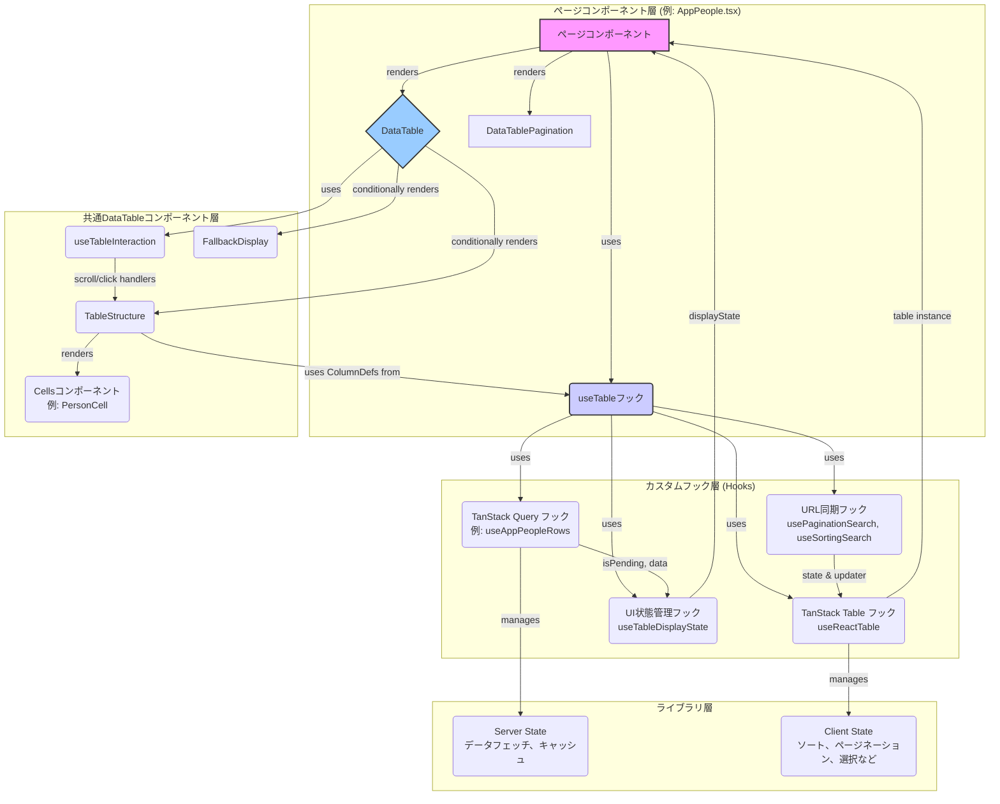

## はじめに
こんにちは、ふるしょうです。
DRESS CODEのフロントエンドは、10プロダクトをmonorepo構成の単一リポジトリで開発しています。(デザインシステムはnpm packageとして別管理)
2025年6/10時点、全プロダクトで50個のデータテーブルが存在していて、(多いw)
そのうち48個がTanstack Tableベースの共通コンポーネント(DataTable)を利用してDRESS CODEシリーズ全プロダクトのUI/UXを統一しています。

先日、カスタマーサポートチームからデータテーブルのインタラクションに関するフィードバックを貰い、これを機に既存の設計を見直す機会がありました。
本記事では、その過程で直面した課題、特に Tanstack Query の `initialData` オプションに起因する微妙なUIの不整合、そこから現在の設計に至るまでの学びや改善策について、具失敗談も交えながらご紹介します！

この記事が、Tanstack Query と Tanstack Table を活用したデータテーブル運用のより良い設計を考える一助となれば幸いです！

## TL;DR（要約）

*   **UXを制御する状態管理**: `useQuery`の`initialData`オプションが引き起こすUIの不整合（ちらつき、意図しない空表示）を特定。`isPending`と`data`の有無からUIの状態を厳密に定義するカスタムフック`useTableDisplayState`を導入し、この問題を解決
*   **宣言的なUI定義**: `Column`ヘルパーと`Cell`コンポーネントという抽象化レイヤーを導入し、開発者は「何を」表示したいかだけを宣言すれば良い設計を採用し、UIの一貫性を担保
*   **URL-Drivenな状態**: テーブルのページネーションやソート順をURLクエリパラメータと同期させることで、リロード耐性やリンク共有といったユーザー体験を向上。

## 課題と対策

まず、現状の設計(課題に対して対策した後の設計です)


ここではアーキテクチャを決定づけた2つの大きな課題と、その解決策について解説します。

### 課題1：完璧なはずの状態分離が引き起こしたUXの罠

Server Stateを管理する`useQuery`の実装において、設計ミスをしました。`initialData`オプションを指定すると、`query.data` の型は `TData | undefined` から `TData` に変更されるため、呼び出し側でundefinedのハンドリングを意識しなくて良くなると、安易に`initialData: []`オプションを使用してしまったのです。


**【問題の発生】**

`initialData`の存在は、TanStack Queryの内部状態に大きな影響を与えます。公式ドキュメントにも記載がある通り、`initialData`はキャッシュに永続化されるため、たとえ実際のデータフェッチがまだ実行されていても、`isPending`フラグが`true`になりません。
> "initialData is persisted to the cache, so it is not recommended to provide placeholder, incomplete, or partial data to this option."
> \- [TanStack Query Docs: Initial Data](https://tanstack.com/query/latest/docs/framework/react/guides/initial-data)

クエリは即座に`status: 'success'`となり、`data`には`initialData`の空配列が格納されます。この挙動が、Client State（ひいてはUI全体）に悪影響を及ぼしました。

*   **ページの初回ロード時**: `isPending`が`true`にならないためローディング表示がスキップされ、即座に`data`（空配列）でテーブルが描画される。その結果、「データがありません」という表示が一瞬映り込み、画面が**ちらつく**。
*   **検索前の初期画面**: ユーザーがまだ何も操作していないにもかかわらず、「検索結果がありません」と表示されてしまう。

これはServer Stateの管理手法の誤りが、UIの状態遷移を意図通りに制御できなくさせ、結果としてUXを著しく損なった典型例でした。

**【対策】 `useTableDisplayState`によるUI状態の厳密な定義**

この問題を解決するため、私たちは`initialData`の使用をきっぱりと止め、`data`が`undefined`になりうることを許容しました。その上で、UIの表示状態をより厳密に制御するためのカスタムフック `useTableDisplayState` を導入しました。

**`src/apps/app/src/components/DataTable/Table/useTableDisplayState.ts`**
```ts
export const useTableDisplayState = <TData>(
  isPending: boolean,
  data: TData[] | undefined, // dataはundefinedになりうる
  options?: { isInitialState?: boolean; /* ... */ },
): TableDisplayState => {
  return useMemo(() => {
    // 1. isPendingがtrueなら、問答無用で"loading"
    if (isPending) return { state: "loading" };
    
    // 2. isInitialStateがtrue (dataがundefined)なら"placeholder"
    if (options?.isInitialState) return { state: "placeholder" };

    // 3. データ取得済みだが0件なら"empty"
    if (data.length === 0) return { state: "empty" };

    // 4. 上記以外ならデータ表示状態
    return { state: "data" };
  }, [isPending, data, options?.isInitialState]);
};
```
このフックは、**`isPending`と`data`の有無という信頼できる情報源**から、「ローディング中」「検索前」「結果なし」「データあり」というUIの状態を明確に区別します。これにより、Server Stateの挙動にUIが引きずられることなく、意図した通りの状態遷移を実現できるようになりました。

### 課題2：開発体験の課題 - 繰り返されるボイラープレート

UXの問題は解決しましたが、次に開発効率の課題が浮上しました。アーキテクチャは固まったものの、テーブルを実装するたびに`ColumnDef`を詳細に記述するのは冗長です。特に、頻出するカラム（人物、日付など）の実装が開発者ごとに微妙に異なり、UIの一貫性が損なわれるリスクがありました。

**【対策】 `Column`ヘルパーと`Cell`コンポーネントによる抽象化**

この課題に対し、私たちは「実装の詳細」をカプセル化し、「宣言的な定義」を可能にする2つの抽象化レイヤーを導入しました。

1.  **`Column`ヘルパー**: `personColumn(...)`のようなファクトリー関数。カラムの構造（ID、ソート可否など）のボイラープレートを隠蔽します。
2.  **`Cell`コンポーネント**: `PersonCell`のようなReactコンポーネント。実際のセルの見た目を担当します。

**`src/apps/app/src/components/DataTable/Columns/personColumn.tsx`**
```tsx
import PersonCell from "../Cells/PersonCell";
// ...

export function personColumn<TData>(
  id: NestedKeys<TData>,
  helperOptions: HelperOptions
): ColumnDef<TData> {
  return {
    accessorKey: id,
    meta: { i18nKey: helperOptions.i18nKey ?? "person" },
    header: DataTableColumnHeader,
    // 実装の詳細はPersonCellに委譲
    cell: ({ getValue }) => <PersonCell person={getValue()} />,
  };
}
```
これにより、テーブルを実装する開発者は、**`personColumn('user', { i18nKey: 'userName' })`** のように、意味のある単位で宣言的にカラムを定義するだけでよくなりました。

## この設計がもたらす柔軟性と拡張性

このアーキテクチャは、DI（依存性の注入）パターンにより、高い柔軟性と拡張性を持ちます。

例えば、`DataTable`に`onRowClick`プロパティを渡すだけで、行クリック時の挙動をページごとに定義できます。内部の`useTableInteraction`フックが、セル内のボタンクリックといったイベントとの競合を自動でハンドリングしてくれます。

**`DataTable.stories.tsx`より抜粋**
```tsx
export const WithRowClick: Story = {
  args: {
    data: sampleUsers,
    displayState: { state: "data" },
    onRowClick: (row) => { // onRowClickに関数を渡す
      alert(`${row.name}の行がクリックされました。\nID: ${row.id}`);
    },
  },
};
```

同様に、`useTableDisplayState`に`emptyContent`を渡せば、「データがありません」の表示をページ固有のカスタムコンポーネントに差し替えることも可能です。

## 今後の展望

*   **テーブルの仮想化**: 数百行を超えるデータを扱う場合、[TanStack Virtual](https://tanstack.com/virtual/latest)を組み込むことで、DOM要素を画面に見えている分だけレンダリングし、パフォーマンスを劇的に向上させることができます。
*   **高度なフィルタリング機能**: 現在はURLクエリベースの単純なフィルタリングですが、各列に対してテキスト検索や日付範囲選択などのUIを提供し、`useReactTable`の`onColumnFiltersChange`と連携させることで、よりインタラクティブなデータ操作機能を提供できます。

## まとめ

本記事では、私たちの`DataTable`コンポーネントが、状態分離という理想から出発し、`initialData`の罠という現実的な課題に直面し、それを乗り越えることで真に成熟したアーキテクチャへと至った道のりを紹介しました。





----

# Gemini向けのプロンプト


https://tanstack.com/table/latest/docs/framework/react/examples/query-router-search-params

のように、Tanstack Router, Query , TableをSearch Paramsを活用した設計であることも強調したい。

URL-Drivenな状態というのは適切な表現ではないね。


実際のソースコードを共有するから、これらを踏まえて正しく外部のエンジニアが認識できる内容に改善しましょう。

```typescript : src/apps/app/src/components/DataTable/Table/DataTable.tsx
import { cn } from "@/lib/cn";
import { defaultNS, useTranslation } from "@/lib/i18n";
import type { Props } from "../types";
import { FallbackDisplay } from "./FallbackDisplay";
import { TableStructure } from "./TableStructure";
import { useTableInteraction } from "./useTableInteraction";

const DEFAULT_SKELETON_ROWS = 10;
const MIN_SKELETON_ROWS = 5;

export default function DataTable<TData>({
  table,
  displayState,
  className,
  rootClassName,
  onRowClick,
  isHoverable,
}: Props<TData>) {
  const { t } = useTranslation(defaultNS, {
    keyPrefix: "component.dataTable",
  });

  // テーブルインタラクション（スクロール、クリック）の管理
  const { containerRef, isScrolling, handleRowClick } = useTableInteraction({
    onRowClick,
  });

  // プレースホルダー表示の場合
  if (displayState.state === "placeholder") {
    return (
      <FallbackDisplay
        content={displayState.content}
        defaultMessage={t("placeholder")}
        rootClassName={rootClassName}
      />
    );
  }

  // 空状態表示の場合
  if (displayState.state === "empty") {
    return (
      <FallbackDisplay
        content={displayState.content}
        defaultMessage={t("noResult")}
        rootClassName={rootClassName}
      />
    );
  }

  // スケルトンローディング表示時のスケルトン行数を決定
  const skeletonRowCount =
    displayState.state === "loading"
      ? Math.max(
          table.getState().pagination.pageSize || DEFAULT_SKELETON_ROWS,
          MIN_SKELETON_ROWS,
        )
      : 0;

  return (
    <div
      ref={containerRef}
      className={cn(
        "h-full overflow-auto rounded-md bg-background",
        rootClassName,
      )}
    >
      <TableStructure
        table={table}
        className={className}
        isScrolling={isScrolling}
        onRowClick={handleRowClick}
        isHoverable={isHoverable}
        isLoading={displayState.state === "loading"}
        skeletonRowCount={skeletonRowCount}
      />
    </div>
  );
}
```

```typescript : src/apps/app/src/components/DataTable/Table/useTableInteraction.ts
import { useThrottle } from "@/hooks/useThrottle";
import { useEffect, useRef, useState, useCallback } from "react";
import { hasClickableAncestor } from "./clickableElement";

/**
 * テーブルのユーザーインタラクション（スクロール、クリック)管理フック
 * - スクロール状態の検知とスロットリング
 * - 行クリックイベントの処理と競合回避
 * - キーボードアクセシビリティ対応
 */
interface UseTableInteractionOptions<TData> {
  /** 行クリック時のコールバック関数 */
  onRowClick?: (row: TData) => void;
}

interface UseTableInteractionReturn {
  /** テーブルコンテナの参照 */
  containerRef: React.RefObject<HTMLDivElement>;
  /** スクロール状態（カラム固定時の影表示用） */
  isScrolling: boolean;
  /** 行クリックイベントハンドラ */
  handleRowClick: (
    event: React.MouseEvent<HTMLTableRowElement>,
    rowData: any,
  ) => void;
}

export const useTableInteraction = <TData>({
  onRowClick,
}: UseTableInteractionOptions<TData> = {}): UseTableInteractionReturn => {
  const containerRef = useRef<HTMLDivElement>(null);
  const [isScrolling, setIsScrolling] = useState(false);

  // スクロール状態の検知（カラム固定時の影表示用）
  const handleThrottledScroll = useThrottle(
    useCallback(() => {
      setIsScrolling(!!containerRef.current?.scrollLeft);
    }, []),
    100,
  );

  // スクロールイベントリスナーの設定・クリーンアップ
  useEffect(() => {
    const container = containerRef.current;
    if (!container) return;

    container.addEventListener("scroll", handleThrottledScroll);
    return () => container.removeEventListener("scroll", handleThrottledScroll);
  }, [handleThrottledScroll]);

  // 行クリックイベントの処理
  const handleRowClick = useCallback(
    (event: React.MouseEvent<HTMLTableRowElement>, rowData: TData) => {
      if (!onRowClick || !(event.target instanceof HTMLElement)) {
        return;
      }

      // セル内のクリッカブル要素がクリックされた場合は行クリックを無効化
      if (hasClickableAncestor(event.target, event.currentTarget)) {
        event.stopPropagation();
        return;
      }

      onRowClick(rowData);
    },
    [onRowClick],
  );

  return {
    containerRef,
    isScrolling,
    handleRowClick,
  };
};
```

```typescript : src/apps/app/src/components/DataTable/Table/useTableDisplayState.ts
import type { ReactNode } from "react";
import { useMemo } from "react";
import type { TableDisplayState } from "../types";

/**
 * DataTableの表示状態を管理するカスタムフック
 * - データの状態に基づく適切なDisplayStateの決定
 * - パフォーマンス最適化（useMemoによる再計算防止）
 * - 型安全性の保証
 * @template TData データ配列の要素型
 * @param isPending TanStack Queryのquery.isPendingを使用
 * @param data 表示対象のデータ配列（空配列判定に使用）
 * @param options 表示オプション
 * @param options.isInitialState 初期状態かどうか（検索前、フィルター未適用など）
 * @param options.emptyContent データが空の場合に表示するカスタムコンテンツ
 * @param options.placeholderContent プレースホルダー状態で表示するカスタムコンテンツ
 * @returns メモ化されたTableDisplayState オブジェクト
 *
 * ## 使用例
 * ```typescript
 * const ProductPermissionsPage = () => {
 *   const { data, isPending } = useGetProductPermissions();
 *   const displayState = useTableDisplayState(
 *     isPending,
 *     data?.items ?? [],
 *     {
 *       isInitialState: !data, // データが一度も取得されていない場合
 *       emptyContent: <CustomEmptyMessage />,
 *       placeholderContent: <SearchPromptMessage />
 *     }
 *   );
 *
 *   return <DataTable table={table} displayState={displayState} />;
 * };
 *
 * ## 状態の優先順位
 * 1. `loading`: isPendingがtrueの場合（最優先）
 * 2. `placeholder`: isInitialStateがtrueかつisPendingがfalseの場合
 * 3. `empty`: データが空配列かつ初期状態ではない場合
 * 4. `data`: 通常のデータ表示状態（デフォルト）
 *
 * ## placeholder状態の使用想定
 * - 検索クエリが入力されていない初期状態
 * - フィルター条件が設定されていない状態
 * - データフェッチが一度も実行されていない状態
 * - ユーザーにアクションを促したい場合
 */
export const useTableDisplayState = <TData>(
  isPending: boolean,
  data: TData[],
  options?: {
    /** 初期状態かどうか（検索前、フィルター未適用など） */
    isInitialState?: boolean;
    /** データが空の場合に表示するカスタムコンテンツ */
    emptyContent?: ReactNode;
    /** プレースホルダー状態で表示するカスタムコンテンツ */
    placeholderContent?: ReactNode;
  },
): TableDisplayState => {
  return useMemo(() => {
    // 1. 読み込み中の状態を最優先で処理
    if (isPending) {
      return { state: "loading" } as const;
    }

    // 2. 初期状態（検索前、フィルター未適用など）の処理
    if (options?.isInitialState) {
      return {
        state: "placeholder",
        content: options.placeholderContent,
      } as const;
    }

    // 3. データが空の場合の処理（初期状態ではない場合）
    if (data.length === 0) {
      return {
        state: "empty",
        content: options?.emptyContent,
      } as const;
    }

    // 4. デフォルト：通常のデータ表示状態
    return { state: "data" } as const;
  }, [
    isPending,
    data.length,
    options?.isInitialState,
    options?.emptyContent,
    options?.placeholderContent,
  ]);
};
```

```typescript : src/apps/app/src/components/DataTable/types.ts
import type { Table as TableType } from "@tanstack/react-table";
import type { Property } from "csstype";
import type { defaultNS, KeyPrefix, ParseKeys, TOptions } from "@/lib/i18n";
import type { ReactNode } from "react";

/**
 * DataTableの表示状態
 */
export type TableDisplayState =
  | {
      /** データ読み込み中 - スケルトンローディングを表示 */
      readonly state: "loading";
    }
  | {
      /** 初期状態/検索前 - プレースホルダーメッセージを表示 */
      readonly state: "placeholder";
      /** プレースホルダー表示内容（未指定時はデフォルトメッセージ） */
      readonly content?: ReactNode;
    }
  | {
      /** データ表示中 - 通常のテーブルを表示 */
      readonly state: "data";
    }
  | {
      /** データが空 - 空状態メッセージを表示 */
      readonly state: "empty";
      /** 空状態表示内容（未指定時はデフォルトメッセージ） */
      readonly content?: ReactNode;
    };

/**
 * DataTableコンポーネントのプロパティ定義
 *
 * TanStack Tableインスタンスを受け取り、UIを描画するための設定を提供します。
 */
export type Props<TData> = {
  /** TanStack Tableのインスタンス（useReactTableで作成） */
  table: TableType<TData>;
  /** テーブルの表示状態 */
  displayState: TableDisplayState;
  /** テーブル要素に適用するCSSクラス */
  className?: string;
  /** ルートコンテナ要素に適用するCSSクラス */
  rootClassName?: string;
  /** 行クリック時のコールバック関数（行データが引数として渡される） */
  onRowClick?: (row: TData) => void;
  /** クリック時に Hover / Cursor Pointer を表示するかどうか */
  isHoverable?: boolean;
};

/**
 * i18n翻訳キーのプレフィックス定義
 * テーブルヘッダーの翻訳キーは"component.dataTable.headers"以下に配置している
 */
const headerKeyPrefix = "component.dataTable.headers" satisfies KeyPrefix<
  typeof defaultNS
>;

/**
 * テーブルヘッダーのi18nキーの型定義
 */
export type TableHeaderI18nKey = ParseKeys<
  typeof defaultNS,
  TOptions,
  typeof headerKeyPrefix
>;

/**
 * カラム定義ヘルパー関数で使用するオプション
 *
 * DataTableの各種カラムヘルパー関数（simpleTextColumn, simpleDateColumnなど）で
 * 共通して使用される設定オプションを定義しています。
 */
export type HelperOptions = {
  /** テーブルヘッダーのi18nキー（翻訳ファイルで定義されたキーを指定） */
  i18nKey?: TableHeaderI18nKey;
  /** テーブル列の最小幅（CSS単位文字列で指定、例: "200px", "10rem"） */
  minWidth?: Property.MinWidth;
  /** テーブル列の最大幅（CSS単位文字列で指定、例: "300px", "20rem"） */
  maxWidth?: Property.MaxWidth;
  /** テーブル列のソート可否（trueの場合、ヘッダークリックでソート可能） */
  sortable?: boolean;
};
```

```typescript : src/apps/app/src/components/DataTable/Table/TableStructure.tsx
import { cn } from "@/lib/cn";
import { type Table as TableType, flexRender } from "@tanstack/react-table";
import {
  Table,
  TableBody,
  TableCell,
  TableHead,
  TableHeader,
  TableRow,
} from "../../ui/table";
import { SkeletonRow } from "./SkeletonRow";
import { getColumnPinningClassNames } from "./getColumnPinningClassNames";

/**
 * テーブル構造コンポーネント
 *　テーブルの構造的レンダリング（ヘッダー、データ行、スケルトン行）に関する責任を持つ
 */
interface TableStructureProps<TData> {
  /** TanStack Tableインスタンス */
  table: TableType<TData>;
  /** テーブル要素のCSSクラス */
  className?: string;
  /** スクロール状態 */
  isScrolling: boolean;
  /** 行クリックイベントハンドラ */
  onRowClick: (
    event: React.MouseEvent<HTMLTableRowElement>,
    rowData: TData,
  ) => void;
  /** ローディング状態かどうか */
  isLoading?: boolean;
  /** スケルトン行数 */
  skeletonRowCount?: number;
  /** クリック時に Hover / Cursor Pointer を表示するかどうか */
  isHoverable?: boolean;
}

export function TableStructure<TData>({
  table,
  className,
  isScrolling,
  onRowClick,
  isLoading = false,
  skeletonRowCount = 0,
  isHoverable = true,
}: TableStructureProps<TData>) {
  return (
    <Table className={cn("w-full", className)}>
      {/* スティッキーヘッダー（スクロール時も常に表示） */}
      <TableHeader className="sticky top-0 z-20 shadow-sm bg-background">
        {table.getHeaderGroups().map((headerGroup) => (
          <TableRow key={headerGroup.id}>
            {headerGroup.headers.map((header) => (
              <TableHead
                key={header.id}
                colSpan={header.colSpan}
                style={header.column.columnDef.meta?.thStyle}
                className={getColumnPinningClassNames(
                  header.column,
                  isScrolling,
                )}
                role="columnheader"
                aria-sort={
                  header.column.getIsSorted() === "asc"
                    ? "ascending"
                    : header.column.getIsSorted() === "desc"
                      ? "descending"
                      : undefined
                }
              >
                {!header.isPlaceholder &&
                  flexRender(
                    header.column.columnDef.header,
                    header.getContext(),
                  )}
              </TableHead>
            ))}
          </TableRow>
        ))}
      </TableHeader>

      <TableBody>
        {/* スケルトンローディング表示 */}
        {isLoading
          ? Array.from({ length: skeletonRowCount }, (_, index) => (
              <SkeletonRow
                key={`skeleton-row-${index}`}
                table={table}
                rowIndex={index}
                isScrolling={isScrolling}
              />
            ))
          : /* 通常のデータ行を表示 */
            table
              .getRowModel()
              .rows.map((row) => (
                <TableRow
                  key={row.id}
                  data-state={row.getIsSelected() ? "selected" : undefined}
                  role="row"
                  className={cn(
                    isHoverable && "cursor-pointer hover:bg-muted",
                    table.options.meta?.getRowClassName?.(row),
                  )}
                  onClick={(event) => onRowClick(event, row.original)}
                  tabIndex={0}
                  onKeyDown={(e) => {
                    if (e.key === "Enter" || e.key === " ") {
                      e.preventDefault();
                      onRowClick(e as any, row.original);
                    }
                  }}
                >
                  {row.getVisibleCells().map((cell) => (
                    <TableCell
                      key={cell.id}
                      className={cn(
                        "first:pl-6",
                        getColumnPinningClassNames(cell.column, isScrolling),
                        isHoverable && "cursor-pointer",
                        table.options.meta?.getRowClassName?.(row),
                      )}
                      style={cell.column.columnDef.meta?.tdStyle}
                      role="cell"
                    >
                      {flexRender(
                        cell.column.columnDef.cell,
                        cell.getContext(),
                      )}
                    </TableCell>
                  ))}
                </TableRow>
              ))}
      </TableBody>
    </Table>
  );
}
```

```typescript : src/apps/app/src/routes/_staff/apps/_list/people/index.lazy.tsx
import ActionButton from "@/components/Button/ActionButton";
import {
  createFilterDefHelper,
  useComposableFilter,
} from "@/components/ComposableFilter";
import {
  IntegratedAppFilterChip,
  PlaceFilterChip,
} from "@/components/FilterChip";
import { HStack } from "@/components/Layout";
import FillScreen from "@/components/Layout/FillScreen";
import SearchInput from "@/components/SearchInput";
import { useDebouncedCallback } from "@/hooks/useDebouncedCallback";
import { defaultNS, useTranslation } from "@/lib/i18n";
import { createLazyFileRoute, useNavigate } from "@tanstack/react-router";
import { isFunction } from "lodash-es";
import type { ChangeEvent } from "react";
import { useCallback } from "react";
import { AppPeopleTable } from "./-components/AppPeople";
import { WorkForceMegaMenu } from "./-components/WorkForceMegaMenu";
import { useAppPeopleExport } from "./-query";
import type { AppPeopleFilter } from "./-types";

export const Route = createLazyFileRoute("/_staff/apps/_list/people/")({
  component: People,
});

const helper = createFilterDefHelper<AppPeopleFilter>();
const filterDefs = [
  helper("appIntegrationIds", { component: IntegratedAppFilterChip }),
  // helper("workerTypeIds", { component: WorkerTypeFilterChip }),
  helper("placeIds", { component: PlaceFilterChip }),
];

function People() {
  const { t } = useTranslation(defaultNS, { keyPrefix: "pages.apps.people" });
  const { t: tCommon } = useTranslation(defaultNS, {
    keyPrefix: "common",
  });
  const navigate = useNavigate({ from: "/apps/people" });
  const search = Route.useSearch();
  const { mutate: exportAppUsersCsv, isPending } = useAppPeopleExport({
    freeText: search.freeText,
    appIntegrationIdIn: search.appIntegrationIds,
    placeIdIn: search.placeIds,
    category: search.category,
  });
  const filter = useComposableFilter<AppPeopleFilter>({
    filterDefs,
    filterState: search,
    onFilterStateChange: useCallback(
      (state) =>
        navigate({
          search: (prev) => ({
            ...prev,
            ...(isFunction(state) ? state(prev) : state),
          }),
        }),
      [navigate],
    ),
  });

  const handleFilterInput = useDebouncedCallback(
    (e: ChangeEvent<HTMLInputElement>) =>
      navigate({
        search: (prev) => ({
          ...prev,
          freeText: e.target.value,
          pageIndex: 0,
        }),
      }),
    [navigate],
  );

  return (
    <FillScreen className="flex flex-col gap-4 px-12 py-5">
      <HStack className="gap-2 items-center">
        <WorkForceMegaMenu />
      </HStack>
      <HStack className="justify-between items-center p-2 rounded bg-background">
        <HStack className="gap-2">
          <SearchInput
            className="h-8 w-interaction-box-sm"
            placeholder={t("filterPeoplePlaceholder")}
            defaultValue={search.freeText}
            onChange={handleFilterInput}
          />
          {filter.getAllFilterDefs().map(({ component: Component, ...def }) => (
            <Component
              key={def.id}
              value={filter.filterState[def.id]}
              onChange={filter.getOnChangeHandler(def.id)}
            />
          ))}
        </HStack>
        <ActionButton
          icon="Download"
          variant="ghost"
          iconColor="primary"
          onClick={() => exportAppUsersCsv()}
          isLoading={isPending}
        >
          {tCommon("action.export")}
        </ActionButton>
      </HStack>
      <AppPeopleTable />
    </FillScreen>
  );
}
```

```typescript : src/apps/app/src/routes/_staff/apps/_list/people/-components/AppPeople.tsx
import { DataTable, DataTablePagination } from "@/components/DataTable";
import useDocumentTitle from "@/hooks/useDocumentTitle";
import { defaultNS, useTranslation } from "@/lib/i18n";
import { useTable } from "../-hooks/useTable";

export function AppPeopleTable() {
  const { t } = useTranslation(defaultNS, { keyPrefix: "pages.apps.people" });
  useDocumentTitle(t("pageTitle"));

  const { table, displayState } = useTable();

  return (
    <>
      <DataTable table={table} displayState={displayState} />
      <DataTablePagination table={table} />
    </>
  );
}
```

```typescript : src/apps/app/src/routes/_staff/apps/_list/people/-hooks/useTable.tsx
import { usePaginationSearch, useSortingSearch } from "@/lib/listPage";
import { Route } from "..";
import { useAppPeopleRows } from "../-query";
import {
  ColumnsToSortColumns,
  type ORDER_BY_FILTER,
  type SORTABLE_COLUMNS,
  SortColumnsToColumns,
} from "../-constants";
import {
  getCoreRowModel,
  getFacetedRowModel,
  getFacetedUniqueValues,
  getFilteredRowModel,
  getPaginationRowModel,
  getSortedRowModel,
  useReactTable,
} from "@tanstack/react-table";
import { useAppPeopleColumns } from "../-components/columns";
import { useNavigate } from "@tanstack/react-router";
import { useTableDisplayState } from "@/components/DataTable";

export const useTable = () => {
  const search = Route.useSearch();
  const navigate = useNavigate({ from: "/apps/people" });
  const { data, isPending } = useAppPeopleRows(search);

  const [pagination, setPagination] = usePaginationSearch({
    search,
    onSearchChange: (search) => navigate({ search }),
  });
  const [sorting, setSorting] = useSortingSearch({
    search,
    onSearchChange: (search) =>
      navigate({
        search: {
          ...search,
          // NOTE: columnのidがキャメルケース、sortColumnは大文字になっているので変換
          sortColumn:
            ColumnsToSortColumns[search.sortColumn as SORTABLE_COLUMNS],
        },
      }),
    convertSortColumn: (sortColumn) =>
      // NOTE: columnのidがキャメルケース、sortColumnは大文字になっているので変換
      SortColumnsToColumns[sortColumn as ORDER_BY_FILTER],
  });

  const columns = useAppPeopleColumns();

  const table = useReactTable({
    data: data?.data ?? [],
    pageCount: data?.maxPage,
    columns,
    initialState: {
      columnPinning: { left: ["person"], right: ["actions"] },
    },
    state: { pagination, sorting },
    getCoreRowModel: getCoreRowModel(),
    getFilteredRowModel: getFilteredRowModel(),
    getPaginationRowModel: getPaginationRowModel(),
    getSortedRowModel: getSortedRowModel(),
    getFacetedRowModel: getFacetedRowModel(),
    getFacetedUniqueValues: getFacetedUniqueValues(),
    onPaginationChange: setPagination,
    onSortingChange: setSorting,
    manualPagination: true,
    manualSorting: true,
  });

  const displayState = useTableDisplayState(isPending, data?.data ?? []);

  return { table, displayState };
};
```


```typescript : src/apps/app/src/routes/_staff/apps/_list/people/-query/index.ts
import { useMutation, useQuery } from "@tanstack/react-query";
import { convertToAppPeopleTableRows } from "../-adapter";
import type { SearchSchema } from "../-schemas";
import { getAppPeople, getAppPeopleCount, getAppPeopleExport } from "./api";
import type { AppPeopleExportQuery, AppPeopleExportRes } from "./type";
import { downloadFile } from "@/lib/api/utils";

export const useAppPeopleRows = (search: SearchSchema) => {
  return useQuery({
    queryKey: ["appPeople", search],
    queryFn: () =>
      getAppPeople({
        query: {
          freeText: search.freeText,
          appIntegrationIdIn: search.appIntegrationIds,
          contractTypeIn: search.contractTypeIds,
          placeIdIn: search.placeIds,
          page: search.pageIndex + 1,
          pageSize: search.pageSize,
          category: search.category,
          orderBy: search.sortColumn,
          orderDirection: search.sortOrder,
        },
      }),
    select: (data) => ({
      data: convertToAppPeopleTableRows(data),
      page: data.page,
      maxPage: data.maxPage,
    }),
  });
};

export const useAppPeopleExport = (query: AppPeopleExportQuery) => {
  return useMutation({
    mutationKey: ["appPeopleExport", query],
    mutationFn: () => getAppPeopleExport({ query }),
    onSuccess: async (data) => {
      const csvData = data as AppPeopleExportRes;
      if (csvData?.url && csvData?.mode) {
        const filename = `app-people-export-${new Date().toISOString().split("T")[0]}.csv`;
        await downloadFile(csvData.url, filename);
      }
    },
  });
};

export const useAppPeopleCount = () => {
  return useQuery({
    queryKey: ["appPeopleCount"],
    queryFn: () => getAppPeopleCount(),
  });
};
```