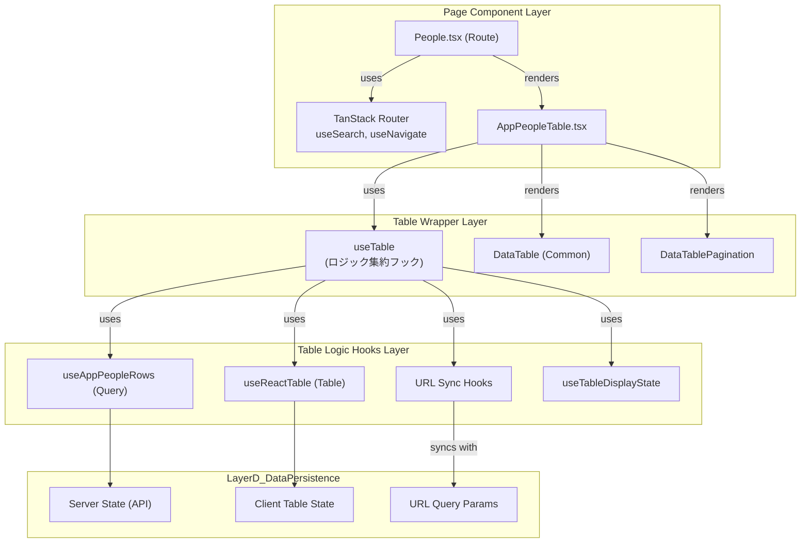

## はじめに
こんにちは、ふるしょうです。
私たちのチームでは、10のプロダクトを単一リポジトリで開発しており、**50個のデータテーブル**が存在します。これだけの規模になると、UI/UXの一貫性を保ちつつ、開発効率を落とさないための汎用的なテーブル設計が極めて重要になります。

DRESS CODEでは、TanStack Tableをベースにした共通コンポーネント `DataTable` を開発し、プロダクト横断で統一されたユーザー体験を目指してきました。

しかし、先日カスタマーサポートチームから「**テーブルのデータが一瞬ちらついて見える**」「**検索する前から"結果がありません"と表示されるのは紛らわしい**」という具体的なフィードバックが寄せられました。これを機に `DataTable` の設計をゼロから見直した結果、多くの学びと改善が生まれました。

本記事では、その試行錯誤の過程で直面した課題と、それらを乗り越えて確立した**堅牢かつ柔軟なDataTableアーキテクチャ**を紹介します。TanStack QueryとTableを使った大規模なフロントエンド開発に携わる、すべての開発者にとって実践的なヒントとなれば幸いです。

## TL;DR
*   **UIのちらつき問題の解決**: TanStack Queryの `initialData` の意図しない誤用から、Server StateとClientStateを再設計
*   **開発者体験(DX)の向上**: 冗長なカラム定義を抽象化し、宣言的にUIを構築する `Column` ヘルパーと `Cell` コンポーネントのパターンを紹介
*   **複雑なインタラクションの分離**: 行クリックとセル内要素の競合といったUIロジックを集約し、コンポーネントの見通しを改善。
*   **状態の永続化と共有**: TanStack Routerを活用し、ページネーションやソート順をURLクエリパラメータと同期させ、ユーザー体験を向上。


## `initialData`の誤用が引き起こしたUXの棄損
UIのちらつきの根本的な原因は、TanStack Queryの `useQuery` フックにおける `initialData` オプションの誤用でした。

当初、`query.data` の型が `TData | undefined` から `TData` として扱える利便性のために `initialData: []` のようにデフォルト値を指定していました。

```typescript
// 当初の実装例
const { data, isPending } = useQuery({
  queryKey: ['users'],
  queryFn: fetchUsers,
  initialData: [], 
});
```

しかし、この実装がUXの低下を招きました。TanStack Queryの公式ドキュメントが警告している通り、`initialData` はキャッシュに永続化される「正規のデータ」として扱われます。

> IMPORTANT: initialData is persisted to the cache, so it is not recommended to provide placeholder, partial or incomplete data to this option and instead use placeholderData

https://tanstack.com/query/latest/docs/framework/react/guides/initial-query-data#using-initialdata-to-prepopulate-a-query

`initialData` が存在すると、TanStack Queryはそれをキャッシュヒットとみなし、**実際のデータフェッチが開始されても `isPending` フラグが `true` になりません**。クエリは即座に `status: 'success'` となり、UIは「データ0件の成功状態」としてレンダリングされます。その後、非同期のフェッチが完了して初めて実データで再描画されるため、以下の問題が発生します。

*   **初回ロード時のちらつき**: `isPending` が `true` にならないため、本来表示すべきローディングスケルトンがスキップされる。代わりに「データがありません」というメッセージが一瞬表示され、その直後にデータが表示されるという**ちらつき**が発生。
*   **ユーザーの誤解**: ユーザーが検索を実行する前の初期画面で「検索結果がありません」と表示され、操作をためらわせる原因となる。

これは、ライブラリの挙動を深く理解せずにAPIを使用してしまった結果、UIの状態遷移を制御できなくなった典型的な失敗例でした。

## 解決策1：UI表示状態(Client State)を宣言的に管理
この問題を根本的に解決するため、 `initialData` の使用を完全に廃止しました。そして、`query.data` が `undefined` になりうることを受け入れた上で、UIの表示状態をよりきめ細かく、かつ宣言的に管理するためのカスタムフック **`useTableDisplayState`** を導入しました。

このフックは、サーバーの状態 (`isPending`, `data`) とUIの文脈 (`isInitialState`) という2つの情報源から、テーブルが取るべき表示状態 (`loading`, `placeholder`, `empty`, `data`) を一意に決定する、**UI表示のための状態管理ロジック**です。

```typescript:src/components/DataTable/types.ts
import type { ReactNode } from "react";

export type TableDisplayState =
  | { readonly state: "loading" }
  | { readonly state: "placeholder"; readonly content?: ReactNode }
  | { readonly state: "data" }
  | { readonly state: "empty"; readonly content?: ReactNode };
```

```typescript:src/components/DataTable/Table/useTableDisplayState.ts
import type { ReactNode } from "react";
import { useMemo } from "react";
import type { TableDisplayState } from "../types";

export const useTableDisplayState = <TData>(
  isPending: boolean,
  data: TData[] | undefined,
  options?: {
    isInitialState?: boolean;
    emptyContent?: ReactNode;
    placeholderContent?: ReactNode;
  },
): TableDisplayState => {
  return useMemo(() => {
    // 1. 読み込み中 (isPending) を最優先で処理
    if (isPending) {
      return { state: "loading" };
    }

    // 2. 検索前などの初期状態 (isInitialState)
    if (options?.isInitialState) {
      return {
        state: "placeholder",
        content: options.placeholderContent,
      };
    }

    // 3. データが空の場合 (データフェッチ後)
    if (!data || data.length === 0) {
      return {
        state: "empty",
        content: options?.emptyContent,
      };
    }

    // 4. 上記以外 (データ表示)
    return { state: "data" };
  }, [
    isPending,
    data,
    options?.isInitialState,
    options?.emptyContent,
    options?.placeholderContent,
  ]);
};
```

このフックの重要なポイントは以下の通りです。

1.  **明確な状態の優先順位**:
    *   `loading`: `isPending` が `true` の時。データフェッチ中であり、最優先でローディング表示にします。
    *   `placeholder`: `isPending` が `false` かつ `isInitialState` が `true` の時。これはユーザーが検索などの操作を行う前の初期状態を示します。
    *   `empty`: `isPending` が `false` かつ `isInitialState` が `false` で、データが空配列の時。これは検索などを実行したが、結果が0件だった状態です。
    *   `data`: 上記いずれでもない、正常にデータを表示する状態。

2.  **`isInitialState` オプションの導入**: このフラグが「まだ操作されていない状態」と「操作したが結果がなかった状態」を区別する鍵です。これにより、「検索前なのに"結果なし"」という紛らわしい表示を防ぎます。このフラグは、URLのクエリパラメータの有無などで制御します。

3.  **柔軟なカスタムコンテンツ**: `emptyContent` や `placeholderContent` を通じて、各状態の表示内容をページごとにカスタマイズ可能にし、汎用性と個別最適化を両立を意識しました。

この `useTableDisplayState` を `DataTable` コンポーネントで利用することで、意図した通りの安定したUI表示を実現できました。

```typescript:src/components/DataTable/Table/DataTable.tsx
// ...
export default function DataTable<TData>({
  table,
  displayState, 
  // ...
}: Props<TData>) {
  // ...

  // 状態に応じてフォールバックUIを表示
  if (displayState.state === "placeholder") {
    return <FallbackDisplay content={displayState.content} defaultMessage="検索を開始してください" />;
  }
  if (displayState.state === "empty") {
    return <FallbackDisplay content={displayState.content} defaultMessage="検索結果がありません" />;
  }

  const isLoading = displayState.state === "loading";

  // ローディング中か、データが存在する場合にテーブル構造を描画
  return (
    <div /* ... */ >
      <TableStructure
        table={table}
        isLoading={isLoading}
        // ...
      />
    </div>
  );
}
```

## 解決策2：カラム定義の抽象化で開発者体験(DX)を改善
多くのテーブルが必要で、その都度TanStack Tableの `ColumnDef` を手で書くのは非常に冗長です。特に、人物名、日付、ステータスなど頻出するカラムのロジックが開発者ごとに微妙に異なり、UIの一貫性が損なわれるリスクがありました。

この課題に対し、「**宣言的な定義**」を可能にする抽象化レイヤーを導入しています。

1.  **`Column` ヘルパー関数**: `personColumn(...)`, `dateColumn(...)` のような、カラム種別ごとのファクトリー関数です。これらは、IDや表示名、ソート可否といった共通設定のボイラープレートを内部で処理し、`ColumnDef` オブジェクトを返します。
2.  **個別最適化した `Cell` コンポーネント**: `PersonCell`, `DateCell` のような、セルの見た目と振る舞いを担当するコンポーネントです。値のフォーマットやアイコンの表示などをカプセル化します。

このアプローチにより、開発者は複雑な `ColumnDef` を意識することなく、意味のある単位でカラムを宣言的に定義できるようになります。

```typescript
// カラム定義の例
import { createColumnHelper } from '@tanstack/react-table';
// 自作のヘルパー関数群
import { personColumn, dateColumn, statusColumn } from '@/components/DataTable/columnHelpers';

const columnHelper = createColumnHelper<User>();

const columns = [
  personColumn(columnHelper, 'user', { i18nKey: 'userName' }),
  dateColumn(columnHelper, 'lastLoginAt', { i18nKey: 'lastLogin', sortable: true }),
  statusColumn(columnHelper, 'status', { i18nKey: 'status' }),
];
```

TanStack Tableの `flexRender` ユーティリティが、これらのヘルパーによって `header` や `cell` に設定されたコンポーネントやJSXを描画してくれます。この抽象化によって、開発効率とUIの一貫性は向上しました。

## 解決策3：複雑なインタラクションを `useTableInteraction` に分離する
データテーブルには、スクロール、行クリック、セル内ボタンのクリックなど、様々なユーザーインタラクションが伴います。これらのロジックを `DataTable` コンポーネント内に直接書くと、すぐに見通しが悪くなります。

そこで、テーブルのインタラクションに関連するロジックを **`useTableInteraction`** というカスタムフックにすべて集約しています。

```typescript:src/components/DataTable/Table/useTableInteraction.ts
import { useThrottle } from "@/hooks/useThrottle";
import { useEffect, useRef, useState, useCallback } from "react";
import { hasClickableAncestor } from "./clickableElement";

interface UseTableInteractionOptions<TData> {
  onRowClick?: (row: TData) => void;
}

export const useTableInteraction = <TData>({
  onRowClick,
}: UseTableInteractionOptions<TData> = {}) => {
  const containerRef = useRef<HTMLDivElement>(null);
  const [isScrolling, setIsScrolling] = useState(false);

  // 1. 横スクロール状態の検知 (スロットリング適用)
  // 固定カラムの影の表示制御などに使用
  const handleThrottledScroll = useThrottle(
    useCallback(() => {
      setIsScrolling(!!containerRef.current?.scrollLeft);
    }, []),
    100,
  );

  useEffect(() => {
    const container = containerRef.current;
    if (!container) return;
    container.addEventListener("scroll", handleThrottledScroll);
    return () => container.removeEventListener("scroll", handleThrottledScroll);
  }, [handleThrottledScroll]);

  // 2. 行クリック処理
  const handleRowClick = useCallback(
    (event: React.MouseEvent<HTMLTableRowElement>, rowData: TData) => {
      if (!onRowClick || !(event.target instanceof HTMLElement)) return;

      // クリックされたのがボタンやリンクの場合、行クリックイベントは発火させない
      if (hasClickableAncestor(event.target, event.currentTarget)) {
        return;
      }

      onRowClick(rowData);
    },
    [onRowClick],
  );

  return { containerRef, isScrolling, handleRowClick };
};
```
このフックの主な責務は以下の2つです。

1.  **スクロール状態の管理 (`isScrolling`)**: 固定カラムがある場合に、横スクロール中か否かを判定し、影の表示などを制御するために使います。パフォーマンスを考慮し、スクロールイベントはスロットリングしています。
2.  **安全な行クリック処理 (`handleRowClick`)**: `onRowClick` が指定された際に、**セル内のボタンやリンクとのクリックイベントの競合を回避します**。`hasClickableAncestor` ユーティリティが、クリックされた要素が別のインタラクティブ要素でないかを判定し、そうであれば行クリックのコールバックは実行しません。これにより、行全体への遷移と、セル内の個別アクションを安全に両立できます。

このようにインタラクションロジックをフックに分離することで、`DataTable` 本体は状態を描画することに集中でき、コンポーネントの見通しが格段に良くなりました。

## DataTableを利用するUIのアーキテクチャ
従業員一覧ページを例としたアーキテクチャの全体像


このアーキテクチャの中心となるのが、ページ固有のロジックを集約したカスタムフック **`useTable`** です。このフックは、データ取得、状態管理、テーブルインスタンスの生成といった関連ロジックを一つにまとめ、各ライブラリとフックを協調させる役割を担います。

### ロジックを集約する `useTable` フックの役割
`useTable` フックは、以下の処理を内包します。

```typescript:src/routes/_staff/apps/_list/people/-hooks/useTable.tsx
import { usePaginationSearch, useSortingSearch } from "@/lib/listPage";
import { Route } from "..";
import { useAppPeopleRows } from "../-query";
import { useAppPeopleColumns } from "../-components/columns";
import { useNavigate } from "@tanstack/react-router";
import { useTableDisplayState } from "@/components/DataTable";
import {
  getCoreRowModel,
  useReactTable,
} from "@tanstack/react-table";

export const useTable = () => {
  const search = Route.useSearch(); // 1. URLから現在の検索条件を取得 (TanStack Router)
  const navigate = useNavigate();

  // 2. URLの検索条件を基にデータをフェッチ (TanStack Query)
  const { data: queryData, isPending } = useAppPeopleRows(search);

  // 3. ページネーションとソートの状態をURLと双方向に同期
  const [pagination, setPagination] = usePaginationSearch({ /* ... */ });
  const [sorting, setSorting] = useSortingSearch({ /* ... */ });

  // 4. カラム定義を取得 (useMemoなどでメモ化されている想定)
  const columns = useAppPeopleColumns();

  // 5. TanStack Tableのインスタンスを生成
  const table = useReactTable({
    data: queryData?.data ?? [],
    pageCount: queryData?.maxPage ?? -1,
    columns,
    state: { pagination, sorting }, // URLと同期した状態を注入
    onPaginationChange: setPagination, // テーブルの操作でURLを更新
    onSortingChange: setSorting,
    manualPagination: true,
    manualSorting: true,  
    getCoreRowModel: getCoreRowModel(),
    // ...
  });

  // 6. UIの表示状態を決定
  const displayState = useTableDisplayState(
    isPending,
    queryData?.data,
    { isInitialState: !queryData && !isPending }
  );

  // 7. tableインスタンスとdisplayStateをコンポーネントに返す
  return { table, displayState };
};
```
このフックの流れは、現代的なデータテーブル実装のパターンと言えます。

1.  **URLを信頼できる情報源とする**: `TanStack Router` を使い、ページネーション、ソート、フィルター条件をURLクエリパラメータで管理します。
2.  **URLからQuery Keyを生成**: URLの `search` パラメータを `useQuery` の `queryKey` に含めることで、検索条件の変更をトリガーに自動でデータが再フェッチされます。
3.  **サーバーサイド処理の明示**: `manualPagination` と `manualSorting` を `true` に設定し、これらの処理をクライアントサイドで行わないことをTanStack Tableに伝えます。実際のデータ操作はAPIに委ねます。
4.  **状態の双方向同期**: テーブルのUI操作 (`onPaginationChange`など) が発生したら、URL同期フック (`setPagination`など) を呼び出してURLを更新します。URLが変わると `useSearch` が新しい値を返し、それが `queryKey` に渡されて再フェッチがトリガーされる、というデータフローが完成します。
5.  **UI状態の決定**: 最後に `useTableDisplayState` を使い、ここまでの状態を基に最終的なUIの表示モードを決定します。

### データアクセス層での工夫
データフェッチを行う `useQuery` の実装にも、UXを向上させる一工夫を加えています。

```typescript:src/routes/_staff/apps/_list/people/-query/index.ts
import { useQuery } from "@tanstack/react-query";
import type { SearchSchema } from "../-schemas";

export const useAppPeopleRows = (search: SearchSchema) => {
  return useQuery({
    queryKey: ["appPeople", search], // searchオブジェクト全体がキー
    queryFn: () => getAppPeople({ /* ...APIリクエストにsearchを渡す... */ }),
    select: (data) => ({ /* ...APIレスポンスをUIの形に変換... */ }),
    
    // ページネーション時に前のデータを表示し続けることで、ちらつきを防ぎUXを向上させる
    placeholderData: (previousData) => previousData,
  });
};
```
`placeholderData: (previousData) => previousData` は非常に重要です。これにより、次のページのデータをフェッチしている間、現在のページのデータが表示され続けるため、ユーザーはデータの読み込み中もコンテキストを失うことがありません。

このアーキテクチャにより、各レイヤーの責務が明確に分離され、見通しが良く、メンテナンス性に優れた `DataTable` を実現しました。
## まとめ
本記事では、共通 `DataTable` コンポーネントが、`initialData` の罠という初期の失敗から始まり、UI状態管理の洗練、インタラクションの分離、そして堅牢なアーキテクチャへと進化してきた道のりを解説しました。

TanStack QueryとTableは、正しく組み合わせることで、非常に強力なデータ表示基盤を構築できるライブラリです。この記事で紹介した設計原則や実践的なノウハウが、皆さんの複雑なデータテーブル実装の一助となれば、幸いです。

最後までお読みいただき、ありがとうございました！
